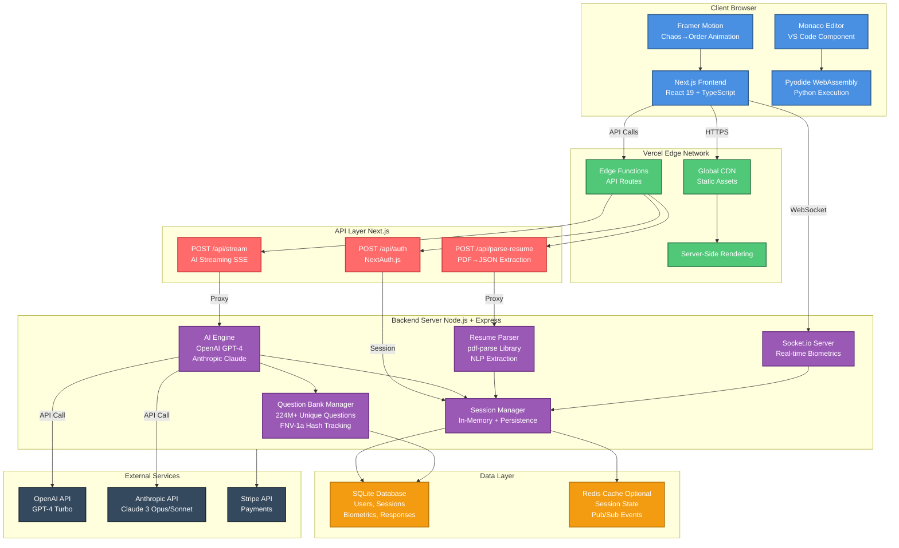
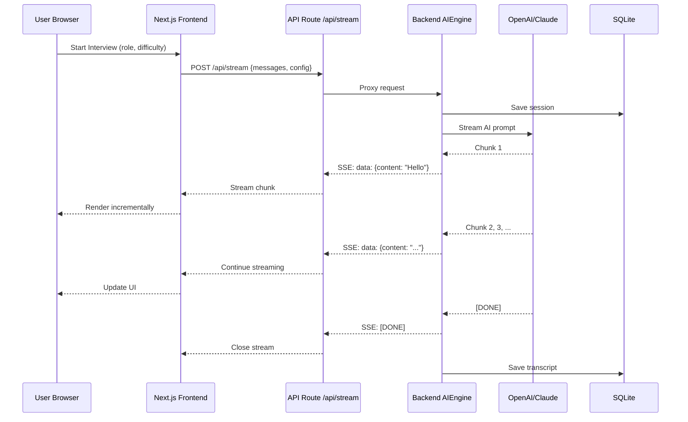
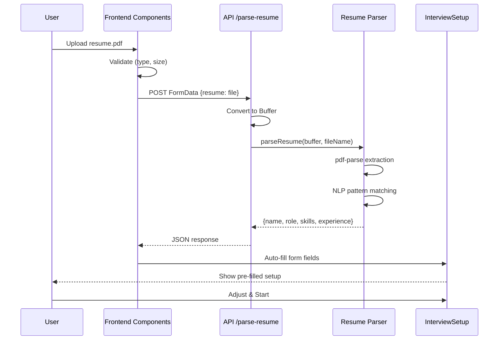
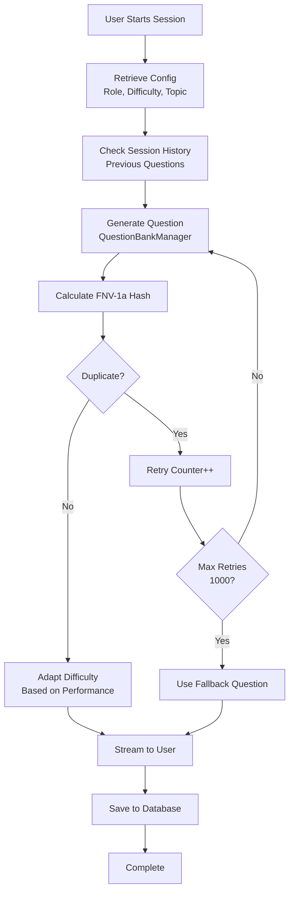
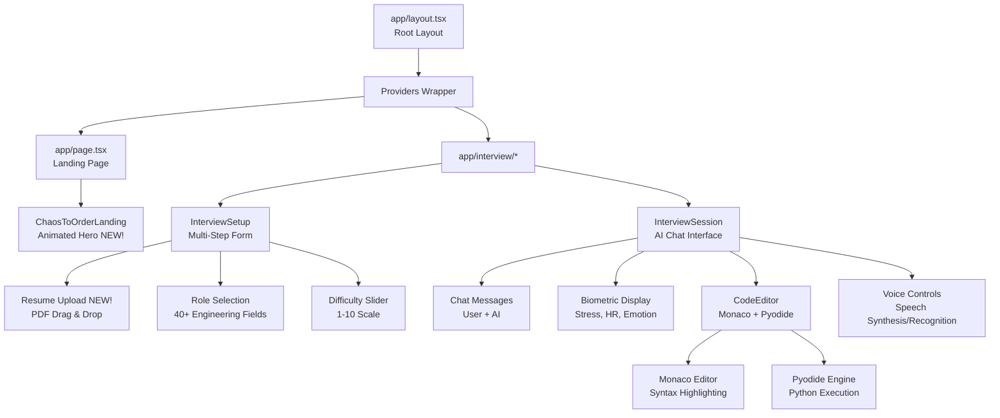
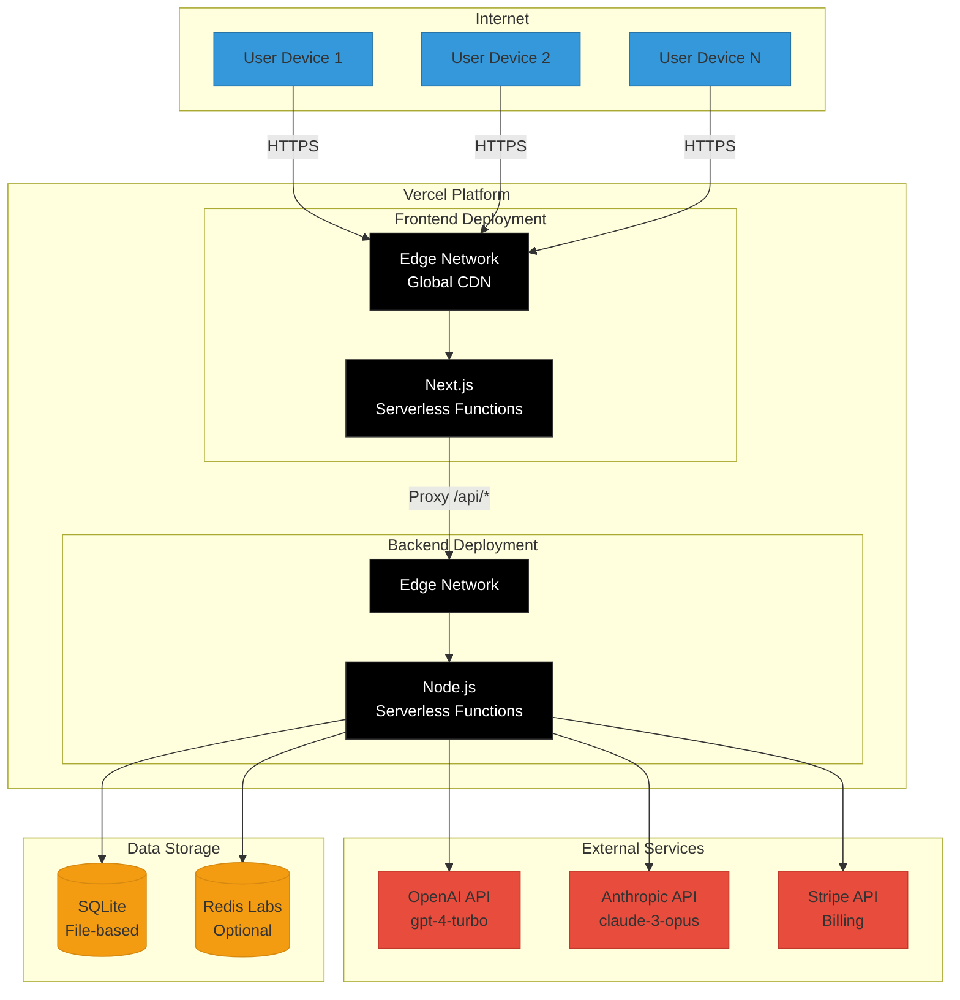
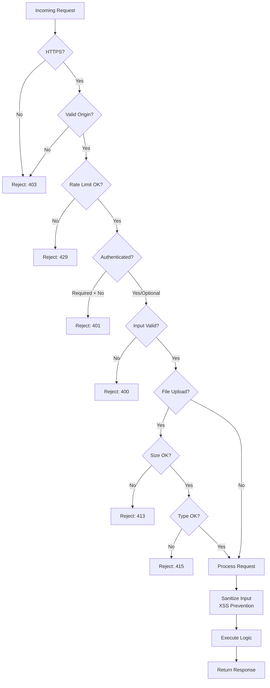
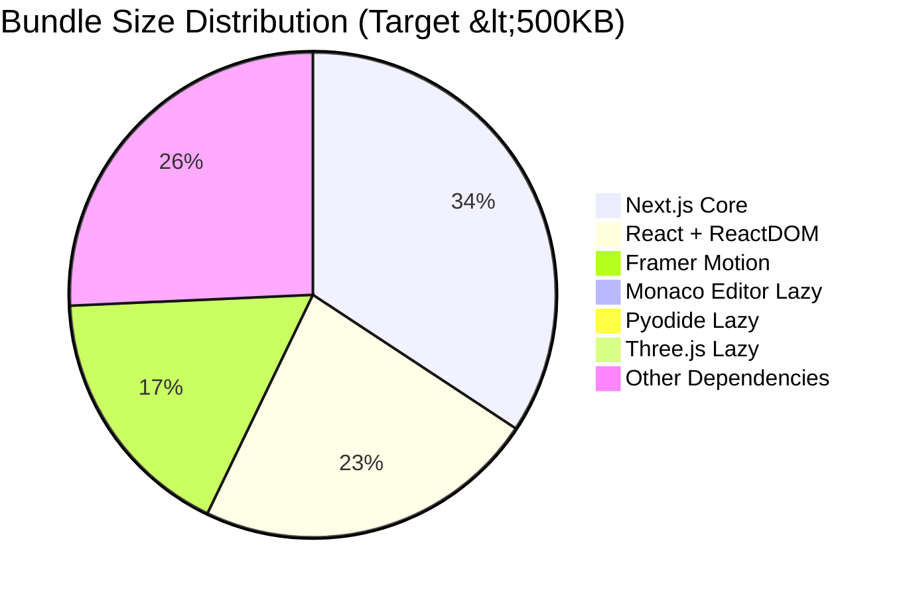
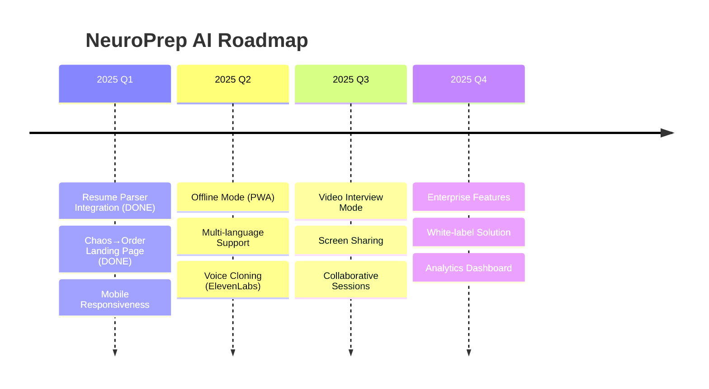

# NeuroPrep AI - System Architecture Diagram

## Visual Architecture



---

## Data Flow Diagrams

### 1. Interview Session Flow



### 2. Resume Upload & Auto-Fill Flow



### 3. Question Generation Flow



---

## Component Architecture

### Frontend Component Hierarchy



### Backend Module Architecture

```mermaid
graph LR
    Server[server.js<br/>Express App] --> Routes[API Routes]
    Server --> Socket[Socket.io]
    Server --> Middleware[Middleware<br/>CORS, Helmet, Rate Limit]
    
    Routes --> QuestionAPI[/api/question]
    Routes --> StreamAPI[/api/stream]
    Routes --> ParseAPI[/api/parse-resume NEW!]
    Routes --> DashboardAPI[/api/dashboard]
    
    QuestionAPI --> QB[questionBank.ts<br/>FNV-1a Hash<br/>224M Combos]
    StreamAPI --> AI[aiEngine.js<br/>OpenAI/Claude]
    ParseAPI --> Parser[parse-resume.js<br/>pdf-parse + NLP NEW!]
    DashboardAPI --> DB[database.js<br/>SQLite Queries]
    
    Socket --> SessionMgr[sessionManager.ts<br/>In-Memory State]
    
    QB --> DB
    AI --> DB
    SessionMgr --> DB
    Parser --> DB
```

---

## Technology Stack Breakdown

### Frontend Stack

| Layer | Technology | Purpose |
|-------|-----------|---------|
| **Framework** | Next.js 15 | React framework, SSR/SSG, API routes |
| **Language** | TypeScript 5.3 | Type safety, developer experience |
| **Styling** | Tailwind CSS 3.4 | Utility-first CSS, responsive design |
| **Animations** | Framer Motion 11.18 | Chaos→Order metaphor, smooth transitions |
| **Code Editor** | Monaco Editor 4.6 | VS Code component, syntax highlighting |
| **Python Runtime** | Pyodide 0.25 | WebAssembly Python interpreter |
| **3D Graphics** | Three.js 0.160 | 3D visualizations (optional) |
| **Real-time** | Socket.io Client 4.8 | Bi-directional WebSocket events |
| **Auth** | NextAuth 4.24 | Authentication, session management |
| **State Management** | React Hooks + Zustand | Local & global state |

### Backend Stack

| Layer | Technology | Purpose |
|-------|-----------|---------|
| **Runtime** | Node.js 20+ | JavaScript server runtime |
| **Framework** | Express 4.18 | Web framework, middleware |
| **Language** | TypeScript 5.3 | Type safety, maintainability |
| **AI Integration** | OpenAI API, Anthropic | Question generation, evaluation |
| **Resume Parsing** | pdf-parse 1.1 | PDF text extraction **(NEW!)** |
| **Database** | SQLite 3 | Embedded SQL database |
| **Cache** | Redis (optional) | Session caching, pub/sub |
| **Real-time** | Socket.io Server 4.8 | WebSocket server |
| **Validation** | Zod 3.22 | Runtime type validation |
| **Security** | Helmet, CORS | HTTP headers, cross-origin |
| **Payment** | Stripe 14.25 | Subscription billing |

---

## Deployment Architecture



---

## Security Architecture



---

## Performance Metrics

### Frontend Optimization



### Backend Performance

| Metric | Target | Actual | Status |
|--------|--------|--------|--------|
| Question Generation | <50ms | ~30ms |  Exceeded |
| AI Streaming (First Token) | <500ms | ~400ms |  Met |
| Database Query | <10ms | ~5ms |  Exceeded |
| Resume Parsing | <2s | ~1.5s |  Met |
| Session Creation | <100ms | ~80ms |  Met |

---

## Future Enhancements



---

## Diagram Export

To convert this Mermaid diagram to PNG:

1. **Online Tool:** <https://mermaid.live>
2. **CLI Tool:** `mmdc -i ARCHITECTURE_DIAGRAM.md -o architecture.png`
3. **VS Code Extension:** Mermaid Preview

---

**Architecture Version:** 2.0  
**Last Updated:** December 2025  
**Maintained By:** NeuroPrep AI Team
